# Lieutenant Fizz

<p align="center">
  
</p>

<p align="center">
  
  
  
</p>

*Lieutenant Fizz* — a series of Keen-style platformers with a 16-colour EGA palette, bright and fun in the spirit of *Goodbye, Galaxy!* and *Aliens Ate My Babysitter*. Every episode runs on the Liminal Retro Engine: a deterministic Rust simulation core compiled to WebAssembly, drawn by a thin Three.js WebGL2 layer in a single instanced draw call, with music and sound written for [Undertone](https://github.com/liminal-hq/undertone).

The first episode is **Episode 1: The Cocoa Caper**, the opening chapter of the first arc, working title *Invasion of the Zargs*. You play Ben "Lieutenant Fizz" Blaze, a 10-year-old tinkerer.

> **Status:** Episode 1 is playable. The port from the original browser prototype (kept in [`design/`](design/) for reference) is done: the simulation runs as Rust compiled to a WASM binary of about 119 kB (48 kB gzipped), the shared engine and each episode live in this monorepo, and CI and the Pages deploy are in place. Full end-to-end playtesting and tuning are still open, and there are no releases yet. When the Pages deploy is live, the series lands at [liminalhq.ca/lieutenant-fizz](https://liminalhq.ca/lieutenant-fizz/) and Episode 1 at [liminalhq.ca/lieutenant-fizz/episode-1](https://liminalhq.ca/lieutenant-fizz/episode-1/).

## Episode 1: The Cocoa Caper

Billy, 14, has vanished. His cousin Ben, 10, finds a secret lab under their treehouse, a prototype spaghetti with meatballs flying saucer, and Billy's map with an X marked *Planet Zargoth*. He straps on his bicycle helmet and follows him.

The saucer has a noodle-upholstered seat, a breadstick yoke, meatball thrusters and marinara exhaust. Zargoth has shining, twinkling crystals, chocolate rivers, mechanical hover platforms, frozen chocolate spikes, and cake buildings with cookie doors. The Zargs are stealing Earth's cocoa beans to refill the planet's drying chocolate rivers, and Billy went after them and was captured. Somewhere behind it all is Mildred McMire, 10, who is building the galaxy's largest chocolate castle to live in.

The full opening cinematic, boss dialogue and ending are in [`docs/STORY.md`](docs/STORY.md).

### The journey

1. Title screen, then an eight-panel opening cinematic (skippable).
2. **The overworld:** a top-down crystal forest split by chocolate rivers. Teleporter pairs power up as levels are cleared, and the game autosaves on every visit.
3. **Crater Fields:** the tutorial biome — slopes, pogo, fizz, chocolate pools and a red gumdrop door.
4. **Crystal Caves:** darker tunnels lit by crystals and Ben's lantern, with hover platforms, a bridge switch, bats and a blue gumdrop door.
5. **Mildred's Citadel:** a boulder ramp, sentries and phantoms, then the boss arena, the security terminal and Billy's cage.
6. A four-panel ending and a score card.

## How it plays

- **Run and jump.** Variable-height jump (release early to cut it short), a 7 tiles/s top speed, and momentum on the ground and in the air.
- **Pogo.** Toggle it on and Ben bounces automatically; hold jump for a high bounce of about 6.6 tiles. Stomping enemies while pogoing bounces higher.
- **Fizz Blaster.** Cream soda bubbles stun enemies for 6 seconds and never kill. Aim up, or down while airborne. Cream soda cans refill it.
- **Stomp.** Landing on most enemies stuns them for 3 seconds.
- **Keys and doors.** Red and blue gumdrops open matching cookie doors.
- **Snacks and lives.** Cheezies, chocolate bars and fudge cookies are worth points; every 100 earns an extra life.
- **A rogues' gallery.** Eleven enemy types, from gloop slugs and crystal bats to Zarg phantoms and gravity drones, each built on a reusable behaviour template, ending with Mildred's Cocoa Colossus.
- **Two control layouts.** Keen-style (Ctrl jump, Alt pogo, Space fire) or modern (Z, X, C), with arrows or WASD to move and standard gamepad support.
- **Quick-save.** F5 saves progress and F9 loads it. Progress is saved at map granularity (lives, score, ammo, cleared levels and map position), not as a mid-level snapshot.

The complete mechanics, collectibles, enemy roster and controls are in [`docs/GAME_DESIGN.md`](docs/GAME_DESIGN.md).

## The Liminal Retro Engine

The engine is game-agnostic. Simulation runs separately from rendering: a deterministic fixed-step core writes into a shared buffer, and a thin WebGL layer draws everything in one instanced call, with lighting from generated normal maps and a DOM overlay (using the Liminal HQ design system) for the HUD, menus, dialogue and sound captions.

| Layer           | Implementation                                                                        |
| --------------- | ------------------------------------------------------------------------------------- |
| Simulation core | Rust → WASM (`wasm32-unknown-unknown`) with raw C-ABI exports: `crates/sim` plus each episode's own crate |
| Renderer        | Three.js over WebGL2 (WebGPU later): one `InstancedBufferGeometry` + `ShaderMaterial` |
| Shell           | Browser tab today; Tauri v2 is planned                                                |
| Audio           | Undertone (`@liminal-hq/undertone`) with a built-in mini-notation synth as a fallback |
| UI              | DOM overlay (React is planned)                                                        |
| Memory          | Zero-copy `Float32Array` view over the WASM linear memory, 20 floats per instance     |

The full specification — camera, atlas, instancing, physics, culling, lighting, audio, input and performance targets — is in [`docs/ENGINE_SPEC.md`](docs/ENGINE_SPEC.md).

## Repository layout

The repository is a monorepo for every Lieutenant Fizz episode.

| Path                     | What it is                                                                                                  |
| ------------------------ | ----------------------------------------------------------------------------------------------------------- |
| `crates/sim`             | `lf-sim`, the game-agnostic Rust simulation core — tile map, AABB physics, slopes, platforms, instance buffer, lights, events and RNG |
| `packages/engine`        | The shared TypeScript engine: pixel DSL and atlas builder, Three.js instanced renderer, input, audio and the WASM loader |
| `episodes/episode-1`     | *The Cocoa Caper*: the Vite app with its sprites, cinematic, DOM overlay, saves, music and story text       |
| `episodes/episode-1/game` | `lf-episode-1`, the episode's own Rust crate: levels, player, enemies, boss, overworld and scene drawing, compiled to `sim.wasm` |
| `site/`                  | The static landing page and game guide (`guide/`) published at the Pages root; episodes are listed in `site/episodes.json`            |
| `scripts/`               | Shell scripts for the WASM build, the Pages site assembly and the licence header check, plus the Bun scripts that build the Fizz font, the hero banner text and the guide sprites |
| `docs/`                  | The engine specification, game design, story text and port status — the ground truth for implementation     |
| `design/`                | The original playable prototype and the Liminal HQ design system, kept for reference                        |
| `.github/workflows/`     | CI and the GitHub Pages deploy                                                                              |

The split is one sentence: deterministic simulation lives in Rust and is exposed through a raw C-ABI export surface (no `wasm-bindgen`); TypeScript renders, handles input and audio, and reacts to simulation state without re-deriving its rules. [`AGENTS.md`](AGENTS.md) (mirrored for Claude Code in [`CLAUDE.md`](CLAUDE.md)) covers contributor conventions.

## Getting started

You will need [Bun](https://bun.sh) and a Rust toolchain with the `wasm32-unknown-unknown` target (`rustup target add wasm32-unknown-unknown`). The WASM is built with plain `cargo build`, so no `wasm-pack` or `wasm-bindgen` CLI is needed.

```bash
bun install
bun run dev         # builds the WASM, then starts the Vite dev server
bun run build       # production build: WASM, TypeScript and Vite
bun run build:site  # landing page plus episodes assembled in dist-site/, as Pages publishes them
bun run test        # TypeScript tests
bun run test:rust   # Rust tests across the Cargo workspace
bun run test:e2e    # Browser layout checks of the overlay (Playwright; not part of validate)
bun run typecheck   # TypeScript type-check
bun run lint        # lint
bun run format      # format TypeScript, markdown and Rust
bun run validate    # the full pre-PR gate: headers, format, lint, type-check, tests and build
```

The `package.json` scripts are the source of truth for exact commands. The original prototype can still be played by opening [`design/Melting Adventures.dc.html`](design/Melting%20Adventures.dc.html); [`design/Last Light.dc.html`](design/Last%20Light.dc.html) is the first engine test scene.

## Status and roadmap

[`docs/ENGINE_SPEC.md`](docs/ENGINE_SPEC.md) marks every engine feature as **Proven** or **Planned**, and [`docs/STATUS.md`](docs/STATUS.md) tracks what the port has built, verified and still lacks:

- **Done:** the Rust port of the simulation (`f64` state, 60 Hz fixed step), the orthographic camera, the palette-indexed atlas, single-draw-call instancing, the zero-copy render bridge, slopes, one-way and moving platforms, culling, autosave, normal-mapped lighting with day and night profiles, the DOM overlay, Undertone audio and the Pages deploy. The WASM is about 119 kB, far under the 2 MB target.
- **Planned:** a sparse grid or quadtree for entity–entity tests, pooled allocation for shots and effects, full mid-level quick-save snapshots, cast shadows, the Tauri shell (including capturing Ctrl and Alt so they don't trigger browser shortcuts), and touch controls.

Open design questions for Episode 1 — difficulty tuning, secret areas, whether death keeps collected snacks, and Mortimer's role in Episode 2 — are listed at the end of [`docs/GAME_DESIGN.md`](docs/GAME_DESIGN.md).

## Part of Liminal HQ

Lieutenant Fizz is a [Liminal HQ](https://liminalhq.ca) project. Its audio is written for [Undertone](https://github.com/liminal-hq/undertone), and its UI shares the Afterglow design system with [Jar](https://github.com/liminal-hq/jar), [Waypoint](https://github.com/liminal-hq/waypoint) and the rest of the family.

## Licence

Licensed under either of the [Apache License, Version 2.0](LICENSE-APACHE) or the [MIT licence](LICENSE-MIT), at your option.

The Fizz pixel font files in [`packages/engine/assets/fonts`](packages/engine/assets/fonts) are licensed separately under the [SIL Open Font License 1.1](packages/engine/assets/fonts/OFL.txt). The code that generates them stays under the dual licence above. See [`docs/FONT.md`](docs/FONT.md).
